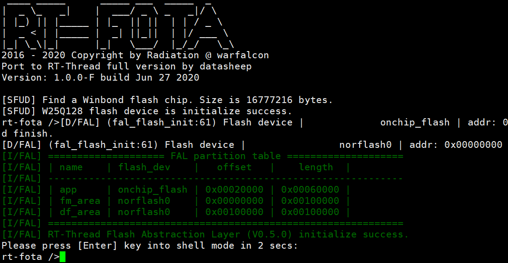

<!--
 * @Description: 
 * @Version: 1.0
 * @Autor: JunQi Liu
 * @Date: 2020-06-26 06:29:58
 * @LastEditors: JunQi Liu
 * @LastEditTime: 2020-06-27 03:36:00
 * @FilePath: \STM32-RTThread-BootLoader\README.md
--> 

# STM32-RTThread-BootLoader
[](https://travis-ci.com/JassyL/STM32-RTThread-BootLoader)
[](https://www.apache.org/licenses/LICENSE-2.0)
## 简介
本项目参考[**基于STM32的开源Bootloader框架-RT-FOTA**](https://gitee.com/spunky_973/rt-fota)进行移植，原 Bootloader 运行于 RT-Thread nano，本移植版本运行 RT-Thread 完整版。

项目所使用的 STM32 BSP 参考 [STM32系列BSP制作教程](https://github.com/RT-Thread/rt-thread/blob/master/bsp/stm32/docs/STM32%E7%B3%BB%E5%88%97BSP%E5%88%B6%E4%BD%9C%E6%95%99%E7%A8%8B.md)完成制作，只添加了必需的串口和SPI驱动，以及内部 FLASH 和 [SFUD](https://github.com/armink/SFUD) 支持，结构简洁。

更多 Bootloader 设计细节，可以移步[**RT-FOTA**](https://gitee.com/spunky_973/rt-fota)

## 搭配使用
如果自动化固件打包需求，可以参考该工具[rt_ota_package_cmd](https://github.com/JassyL/rt_ota_package_cmd)

## 外设支持

本 BootLoader 目前对外设的支持情况如下：

| **板载外设**      | **备注** |
| -|-|
| UART1        | PA9\PA10|
| SPI1 FLASH(W25Q128)    | PB3\PB4\PB5\PB14|

## 使用说明


#### 硬件连接

USART1 GPIO Configuration 
```   
    PA9     ------> USART1_TX
    PA10    ------> USART1_RX 
```

SPI1 GPIO Configuration    
```
    PB3     ------> SPI1_SCK
    PB4     ------> SPI1_MISO
    PB5     ------> SPI1_MOSI 
    PB14    ------> SPI1_CS
```


#### 编译下载

双击 project.uvprojx 文件，打开 MDK5 工程，编译并下载程序到开发板。


#### 运行结果

连接开发板对应串口到 PC , 在终端工具里打开相应的串口（115200-8-1-N），复位设备后，可以看到 RT-Thread 的输出信息:



## 其它说明与测试

参考博客链接:[STM32的开源Bootloader框架-RT-FOTA移植](https://datasheep.cn/71.html)
